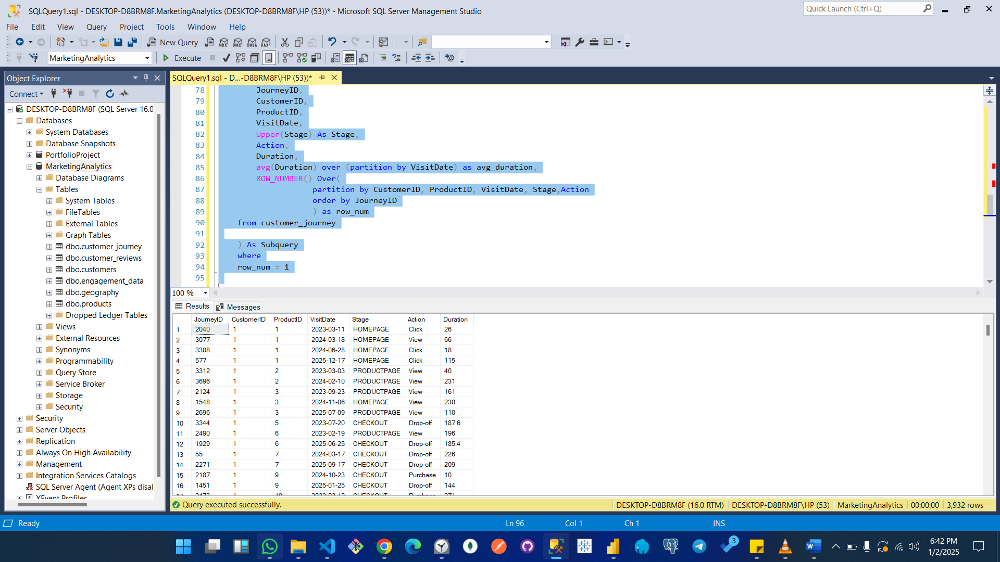
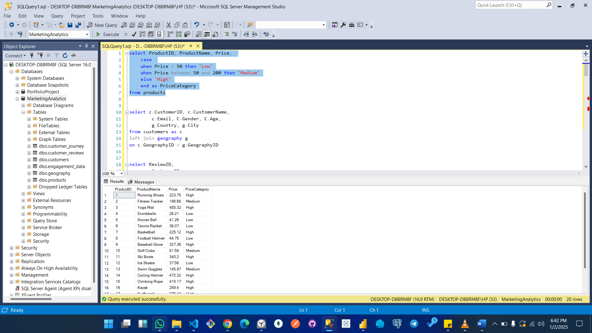
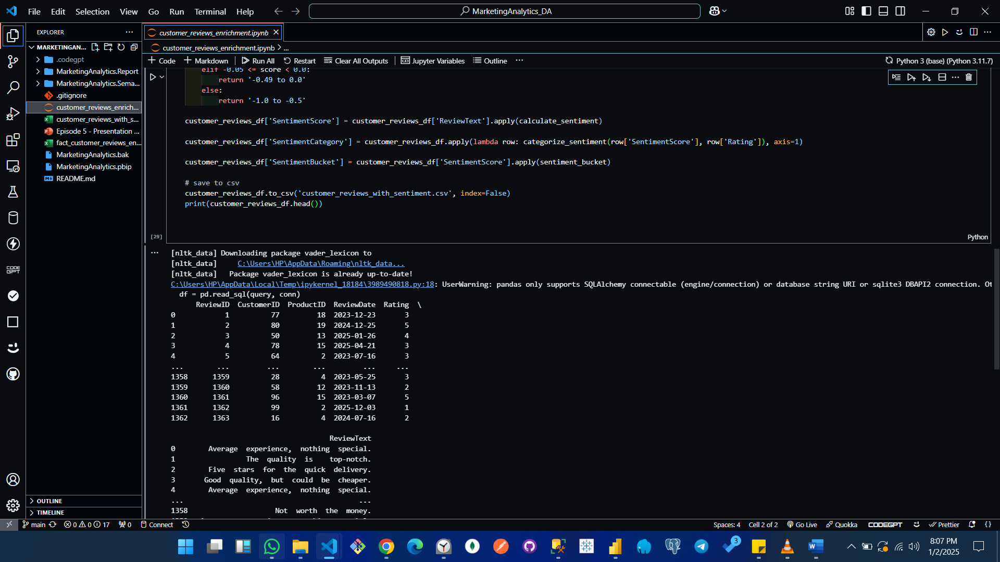
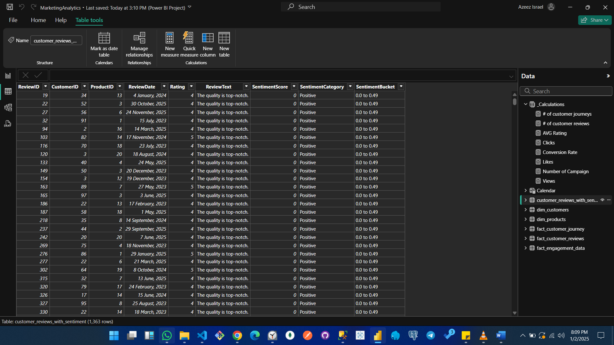
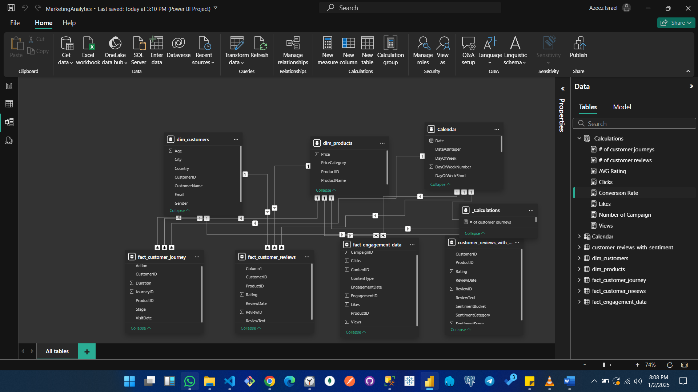
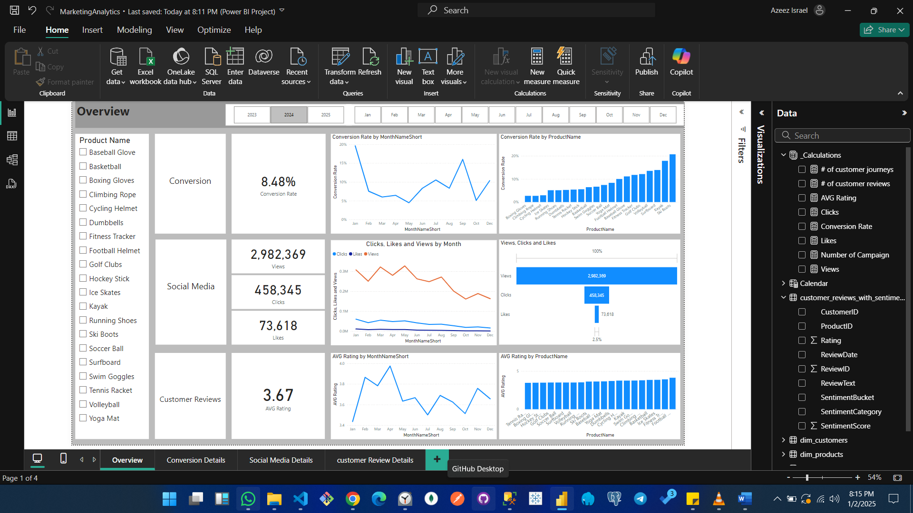
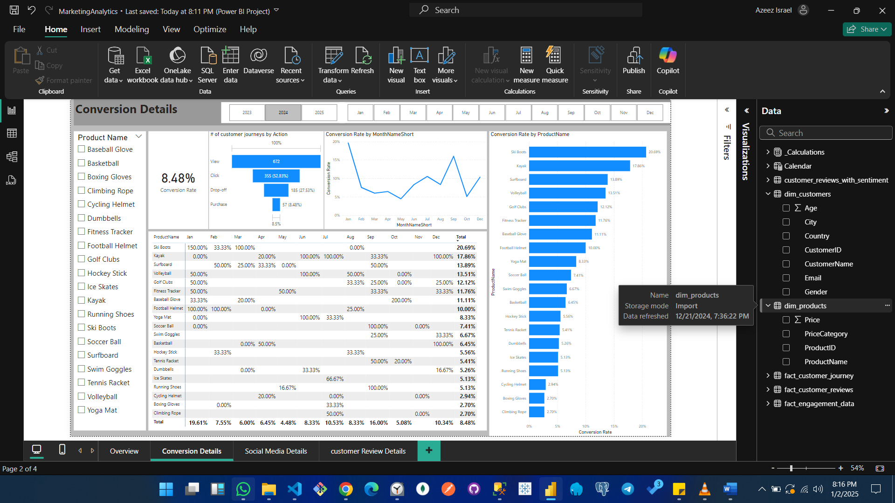
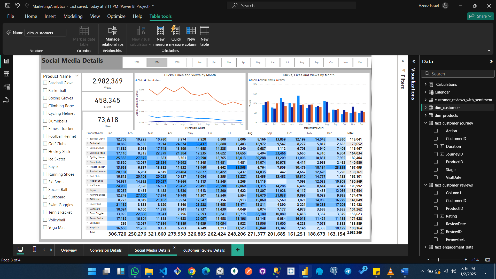
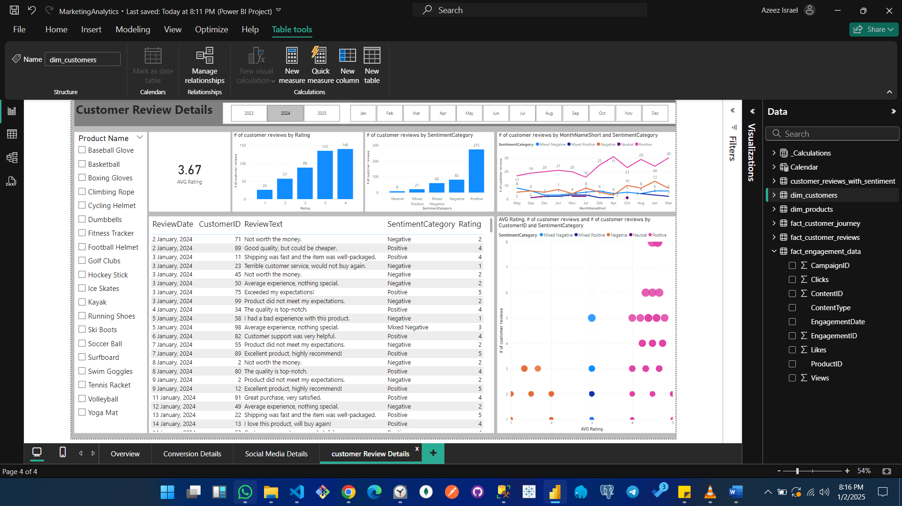

# Marketing Analytics Project Documentation

## 1. Title
**Marketing Analytics Overview**

---

## 2. Introduction
This project provides a comprehensive analysis of marketing data to derive actionable insights into conversion rates, social media engagement, and customer reviews. The analysis is performed using tools like SQL, Python (Jupyter Notebook), and Power BI.

---

## 3. About the Data
The data for this project includes:
- **Conversion Metrics:** Conversion rates, views, and clicks.
- **Social Media Metrics:** Engagement data including likes and shares.
- **Customer Reviews:** Sentiment analysis and average ratings.

Data was sourced from various platforms and stored in an MSSQL database before analysis.

---

## 4. Methodology

### Data Collection
- Data was collected from multiple sources, including customer feedback platforms, social media, and internal marketing databases.
- Consolidated and stored in MSSQL for accessibility.

### Data Cleaning & Transformation
- SQL queries were used to clean and structure the data in MSSQL.
- Additional cleaning and preprocessing were done using Python (Jupyter Notebook) and Power BI Power Query.

### Exploratory Data Analysis
- Performed to understand the data distribution, identify outliers, and uncover patterns.
- Key statistics and trends were visualized.

### Visualization
- Created multiple dashboards in Power BI for data exploration and presentation.
- Dashboards highlight conversion metrics, social media performance, and customer sentiment.

### Statistical Analysis
- Derived metrics such as average conversion rate, click-through rate, and customer sentiment distribution.
- Applied sentiment categorization to customer reviews using Python.

### Interpretation & Recommendations
- Insights were drawn from the analysis to recommend marketing strategies and areas for improvement.

---

## 5. Data Structure Image

---

## 6. Data Model Overview
- The data model includes tables for customers, products, engagement data, customer reviews, and calendar dimensions.
- Relationships between tables were managed in Power BI to enable dynamic filtering and accurate analysis.

---

## 7. Analysis
The analysis focused on three key areas:
1. **Conversion Metrics:** Understanding the factors driving conversion rates.
2. **Social Media Performance:** Examining engagement trends across platforms and time.
3. **Customer Sentiment:** Analyzing customer feedback for actionable insights.

---

## 8. Dashboards

### Overview Dashboard
Displays a summary of key metrics like conversion rates, views, and average ratings.

### Social Media Details
Provides a detailed breakdown of views, clicks, and likes by product and month.

### Customer Review Details
Visualizes customer review sentiment and ratings distribution.

---

## 9. Insights
- Conversion rates are highest for products with targeted marketing campaigns.
- Social media engagement correlates strongly with spikes in conversion rates.
- Positive reviews significantly improve customer retention and loyalty.

---

## 10. Recommendations
- **Targeted Marketing:** Focus campaigns on high-converting products.
- **Social Media Strategy:** Increase content frequency during peak months of engagement.
- **Customer Feedback:** Actively address negative reviews to improve product satisfaction.

---

**Tools Used:**
- **SQL:** Data cleaning and transformation.
- **Python (Jupyter Notebook):** Advanced data preprocessing and sentiment analysis.
- **Power BI:** Interactive visualization and dashboard creation.

[Click here to view on Power Bi Service](https://app.powerbi.com/view?r=eyJrIjoiMWFiMjQzYmItY2EwZC00MjgyLWFlZTQtZjBkMGU1YjVlNWVmIiwidCI6IjhmNzg3ODg0LTA2MTctNDEzMi05MzFhLTQyYjljM2ViNjM3YiJ9)